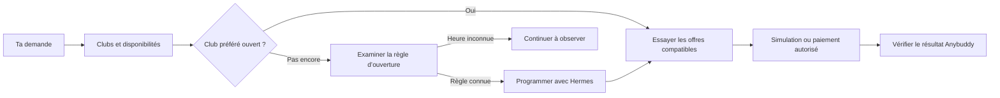

<div align="center">


# Paris Padel · Anybotty

**Le prochain match commence par un message.**

Trouve un terrain sur Anybuddy, repère les ouvertures et programme ta tentative depuis Telegram.
Choisis tes clubs, tes durées et ton budget. Anybotty suit tes préférences jusqu’à la réservation.

**9 clubs au catalogue · 8 clubs surveillés · 6 skills Hermes · Open source**

[Démarrer](#demarrer) · [Voir les exemples Telegram](#telegram) · [Guide complet](docs/guide.md) · [Signaler un problème](https://github.com/RolandVrignon/paris-padel-anybotty/issues)

</div>

---

## Le match de 20 h se prépare avant 20 h

Tu connais la scène : quatre joueurs motivés, une heure parfaite, et plus aucun terrain.

Anybotty s’attaque à ce qui se passe **avant** le match : vérifier les clubs, observer quand les nouveaux jours deviennent réservables, choisir quand tenter sa chance et exécuter la réservation selon tes critères.

> « Lundi prochain à 20 h. Paris Padel en priorité, puis UCPA. Une heure, sinon une heure et demie. Intérieur préféré, 80 €/h maximum. Si Paris Padel n’a pas encore ouvert, je préfère attendre. »

Avec Hermes, cette demande devient une stratégie, puis une tentative immédiate ou programmée lorsque l’heure d’ouverture est connue. Tu gardes la main sur les préférences et les dépenses.

**Le paiement et l’annulation sont intégrés.** Une validation bancaire peut toutefois demander ton intervention : une réservation pendant ton sommeil reste une tentative, jamais une garantie.

<a id="sommaire"></a>
## Le tour du terrain

- [Ce qu’Anybotty fait pour toi](#fonctionnalites)
- [Parle padel, pas JSON](#telegram)
- [La stratégie avant le clic](#strategie)
- [Tes préférences, dans le bon ordre](#preferences)
- [Les clubs](#clubs)
- [Démarrer](#demarrer)
- [Brancher Hermes et Telegram](#hermes)
- [Choisir le bon mode](#modes)
- [Ce qui est validé, ce qui reste à prévoir](#fiabilite)
- [Sous le capot et documentation](#documentation)
- [Contribuer et origine](#contribuer)

<a id="fonctionnalites"></a>
## Ton assistant de bord de terrain

| Tu veux… | Anybotty s’en charge |
| --- | --- |
| **Jouer dans tes clubs favoris** | Résout les noms du catalogue et cherche dans ton ordre de priorité. |
| **Viser les horaires demandés** | Observe les nouvelles disponibilités pour documenter les ouvertures. |
| **Tenter à l’ouverture** | Hermes programme une tentative sur le VPS à partir d’une règle vérifiée ou d’un horaire que tu donnes. |
| **Garder de la souplesse** | Accepte 60, 90 ou 120 minutes, intérieur ou extérieur, dans l’ordre que tu choisis. |
| **Respecter ton budget** | Compare le prix du terrain à un plafond **par heure**, quelle que soit la durée. |
| **Aller jusqu’au bout** | Gère le choix du terrain, les conditions connues, le formulaire carte et le paiement final autorisé. |
| **Changer de programme** | Liste les réservations, affiche leurs conditions et annule sur demande. |
| **Savoir ce qui s’est passé** | Conserve les observations et les résultats ; distingue une offre trouvée d’une réservation confirmée. |

<a id="telegram"></a>
## Parle padel, pas JSON

Une fois [Hermes connecté](#hermes), tu pilotes le projet depuis ton bot Telegram. Les exemples suivants sont des **demandes à lui envoyer**, pas des réservations déjà effectuées.

### 🔎 Trouver

> Quels clubs connais-tu à Bercy ? Vérifie le nom exact de Sportfield.

> Quels créneaux sont disponibles dimanche à 4PADEL Paris 20 à 12 h 30, pour 60 ou 90 minutes ?

### 🎯 Choisir le bon moment

> Je veux jouer lundi prochain à 20 h. Paris Padel d’abord, UCPA ensuite. Si Paris Padel doit encore ouvrir, attends son ouverture avant de te rabattre sur UCPA. Propose-moi la stratégie.

> À quelle heure les nouveaux créneaux apparaissent-ils ? Est-ce répété sur plusieurs jours ou publié par semaine ?

### 🗓️ Programmer

> Programme une réservation réelle à l’ouverture vérifiée du club prioritaire, avec mes préférences et mon plafond de 80 €/h. Si l’heure n’est pas connue, dis-le-moi.

> Quelles tentatives sont programmées ? Annule celle de lundi à 20 h.

### 🎾 Réserver et gérer

> Réserve et paie lundi prochain à 20 h chez Sportfield Bercy : 60 minutes, sinon 90, intérieur uniquement, maximum 80 €/h pour le terrain entier.

> Liste mes réservations à venir et les conditions d’annulation de celle de jeudi.

> Annule ma réservation de jeudi à 20 h chez Sportfield Bercy.

**Tu veux d’abord voir ?** Ajoute « simule, sans payer ». Une simulation atteint le récapitulatif ; elle ne confirme pas la réservation.

[Tous les exemples et les commandes Hermes →](docs/guide.md#parler-au-bot-en-langage-naturel)

<a id="strategie"></a>
## La stratégie avant le clic

Ton deuxième club a une place aujourd’hui. Ton premier choix ouvre demain. **Le premier disponible n’est pas toujours ton premier choix.**

Avec `padel-strategy`, Hermes compare les offres disponibles, tes priorités et les ouvertures observées. Il peut recommander d’attendre le club préféré, puis programmer une tentative si la règle d’ouverture est suffisamment documentée. Le plan B est réévalué après le résultat.



Le collecteur surveille **huit clubs toutes les cinq minutes**, via un timer systemd, sans compte ni modèle IA à chaque passage. Il observe plusieurs dates pour repérer les ouvertures quotidiennes, les publications groupées et les ajouts d’horaires.

Une date absente à 07 h 55 et présente à 08 h donne une ouverture **entre 07 h 55 et 08 h**. Cinq contrôles supplémentaires vérifient la présence de disponibilités pendant environ 25 minutes. Le bot conserve les observations ; il ne transforme pas un seul relevé en règle certaine.

**Deux rôles distincts :** systemd observe ; le cron Hermes déclenche la tentative. La commande directe `booking:search` cherche immédiatement, sans attendre une ouverture future.

[Comprendre les observations](docs/opening-observation.md) · [Programmer selon une politique d’ouverture](docs/guide.md#programmer-selon-la-politique-douverture)

<a id="preferences"></a>
## Tes préférences, dans le bon ordre

Deux fichiers, deux usages :

| Fichier local | Ce que tu y mets |
| --- | --- |
| `config.fixed.json` | Ton compte Anybuddy, le navigateur et les données de paiement si tu actives la réservation réelle. |
| `config.request.json` | Le match que tu veux : date, heure, clubs, durées, type de terrain et plafond horaire. |

Exemple de demande — **remplace la date avant de lancer** :

```json
{
  "date": "21/09/2026",
  "startTime": "20:00",
  "clubs": ["paris-padel", "ucpa-paris", "sportfield-bercy"],
  "durationsMinutes": [60, 90],
  "courtEnvironment": ["indoor", "outdoor"],
  "maxPricePerHourEUR": 80
}
```

| Préférence | Traduction |
| --- | --- |
| `[60, 90]` | Une heure de préférence, 90 minutes en second choix. **120 minutes exclues.** |
| `[90, 60, 120]` | 90 minutes d’abord, puis 60, puis 120. |
| `["indoor", "outdoor"]` | Intérieur préféré, extérieur accepté. |
| `["indoor"]` | Intérieur uniquement. |
| `["any"]` | Peu importe le type de terrain. |

L’ordre complet est **club → durée → intérieur/extérieur → terrain**. Avec `[60, 90]` et `["indoor", "outdoor"]`, une heure dehors passe avant 90 minutes dedans, dans le même club.

### Le budget qui suit la durée

Un plafond de **80 €/h** autorise jusqu’à **80 € pour 60 min**, **120 € pour 90 min** ou **160 € pour 120 min**. Un terrain à 120 € pour deux heures revient à 60 €/h : il respecte donc le plafond.

Le prix concerne **le terrain entier**, pas chaque joueur. Le montant du checkout fait foi et est revérifié avant le paiement. Les dates utilisent `DD/MM/YYYY`, les heures `HH:mm`, en Europe/Paris.

[Configuration complète, carte et compatibilité →](docs/guide.md#configurer-le-compte)

<a id="clubs"></a>
## Paris, un club après l’autre

Neuf centres sont intégrés au catalogue. Les horizons ci-dessous sont des **observations du 11 septembre 2026**, pas des règles contractuelles ni des disponibilités en direct.

| Club | Identifiant | Horizon observé |
| --- | --- | --- |
| Paris Padel | `paris-padel` | J+8 |
| UCPA Sport Station Hostel Paris | `ucpa-paris` | J+8 |
| Sportfield Paris 12 - Bercy | `sportfield-bercy` | J+14 |
| 4PADEL Paris 20 | `4padel-paris-20` | J+3 |
| Forest Hill Aquaboulevard De Paris | `aquaboulevard` | J+6 |
| 4Padel Saint-Ouen | `4padel-saint-ouen` | J+1 |
| Padelistes Bercy - Paris 12 | `padelistes-bercy` | J+8 |
| Padel 15 | `padel-15` | J+5 |
| Trinquet Village | `trinquet-village` | Au moins J+61 ; limite inconnue |

Trinquet Village reste au catalogue mais est exclu de la surveillance des ouvertures. Les heures d’ouverture ne sont pas garanties par ces horizons : elles doivent être documentées séparément.

[Catalogue source](data/clubs.json) · [Audit des horizons](data/horizon-audit-2026-09-11.json) · [Parcours de checkout par club](docs/checkout.md)

<a id="demarrer"></a>
## Ton premier essai

**Prérequis : Node.js 22.22.2 ou 24 et npm.** Un compte Anybuddy est nécessaire pour le checkout ; le catalogue et les observations publiques fonctionnent sans compte.

```sh
git clone https://github.com/RolandVrignon/paris-padel-anybotty.git
cd paris-padel-anybotty
npm ci
npm run config:init
```

Chromium est téléchargé à l’installation. Complète `config.fixed.json` avec ton compte et `config.request.json` avec une date future et tes préférences, puis :

```sh
# Connexion visible et vérification de la session
npm run auth:login-headed
npm run auth:check -- --headless

# Premier essai : atteindre le récapitulatif, sans paiement
npm run booking:search
```

Pour explorer sans connexion :

```sh
npm run clubs:list
npm run booking:plan -- --config config.request.json.sample
```

Le planning est théorique ; adapte la date de l’exemple. **`npm start` affiche l’état du projet** : il ne réserve rien et ne démarre pas le collecteur.

Les deux configurations, `.auth/` et les observations restent locales et sont ignorées par Git. Les fichiers privés créés par `config:init` ont les permissions `0600`. Renseigne les secrets sur la machine qui exécute le bot, jamais dans Telegram.

<a id="hermes"></a>
## Un message le soir. Une tentative à l’ouverture.

Le VPS exécute le navigateur et les tâches programmées. Hermes transforme tes demandes Telegram en appels aux scripts du dépôt.

**Hermes et son intégration Telegram doivent déjà être installés.** Depuis la copie du dépôt sur le VPS :

```sh
npm run hermes:install
# Après avoir renseigné le fichier fixe privé sur ce VPS
npm run auth:login -- --headless
npm run auth:check -- --headless
```

L’installateur ajoute les six skills dans `~/.hermes/skills/` et adapte les chemins au dépôt. Recharge-les dans Telegram avec `/reload-skills`.

| Skill | Sa spécialité |
| --- | --- |
| [padel-clubs](skills/padel-clubs/SKILL.md) | Les bons noms et les disponibilités. |
| [padel-booking](skills/padel-booking/SKILL.md) | Tes préférences, la simulation et le paiement autorisé. |
| [padel-strategy](skills/padel-strategy/SKILL.md) | Attendre ton favori ou choisir un repli. |
| [padel-scheduling](skills/padel-scheduling/SKILL.md) | Programmer et gérer une tentative future. |
| [padel-monitoring](skills/padel-monitoring/SKILL.md) | Observer quand les nouvelles dates apparaissent. |
| [padel-reservations](skills/padel-reservations/SKILL.md) | Lister, consulter et annuler tes réservations. |

Installer les skills ne crée aucun cron. Hermes doit enregistrer la tâche et vérifier son existence pour pouvoir annoncer qu’elle est programmée. Les résultats des tentatives programmées reviennent dans le chat d’origine.

[Installer le timer sur un VPS](docs/guide.md#installer-la-surveillance-sur-un-vps) · [Installation Hermes détaillée](docs/guide.md#installer-les-skills-sur-le-vps)

<a id="modes"></a>
## Explorer, simuler ou réserver : à toi de choisir

| Action | Commande | Effet |
| --- | --- | --- |
| Voir les clubs | `npm run clubs:list` | Consulte le catalogue. |
| Lire les observations | `npm run observe:report` | Affiche les relevés enregistrés. |
| Collecter une fois | `npm run observe:once` | Lit les disponibilités publiques, sans programmer la suite. |
| Simuler tes préférences | `npm run booking:search` | Cherche un récapitulatif conforme, sans paiement. |
| Vérifier la configuration carte | `npm run payment:check` | Contrôle les champs locaux sans les afficher ni contacter la banque. |
| **Réserver et payer** | `npm run booking:pay -- --headless` | **Soumet un paiement réel** pour une offre conforme. |
| Vérifier une tentative incertaine | `npm run booking:reconcile -- --headless` | Relit le compte, sans soumettre un nouveau paiement. |
| Lister tes réservations | `node scripts/reservations.js list` | Consulte les réservations à venir et en attente. |

Les commandes de recherche et de réconciliation utilisent `config.request.json`, ou un fichier explicite avec `--config PATH`. Pour vérifier une tentative passée, garde **la demande originale**.

Une simulation peut créer un panier impayé côté Anybuddy. Le mode `checkout:preview` permet aussi d’aller jusqu’à Stripe et de remplir la carte sans confirmer le paiement. Les options et le parcours d’annulation sont dans le [guide complet](docs/guide.md).

<a id="fiabilite"></a>
## Des résultats vérifiés, des limites visibles

**Un `booked`, c’est une réservation retrouvée et confirmée dans ton compte Anybuddy.** Un récapitulatif atteint ou une réponse Stripe intermédiaire ne suffit pas.

- **Parcours réel validé à UCPA :** paiement puis annulation de la réservation de test, avec vérification du statut.
- **Neuf checkouts inspectés jusqu’à Stripe le 11 septembre 2026 :** sélection du terrain et différences entre formulaire carte direct et choix du moyen de paiement documentées. Cela ne vaut pas neuf paiements réels validés.
- **Protection contre les doubles tentatives :** verrou local, vérification du compte et journal avant paiement. Un résultat incertain arrête les essais automatiques.
- **Décision manuelle possible :** une réinitialisation explicite archive la tentative avant un nouvel essai autorisé. Elle ne prouve pas que l’ancienne transaction est annulée. [Procédure](docs/guide.md#réserver-et-payer).
- **Tests locaux :** configuration, préférences, prix, modales, paiements simulés, annulation, observation et programmation.

Le 3-D Secure peut demander une validation humaine. Sa désactivation n’est pas une option du bot et la reprise interactive après fermeture du navigateur n’est pas encore implémentée. Les créneaux peuvent disparaître, les sessions expirer et le site changer : **l’horaire de déclenchement ne garantit pas l’obtention du terrain**.

<a id="documentation"></a>
## Sous le capot

**Node.js · Playwright · Chromium · systemd · Hermes · Telegram**

Le collecteur public observe les disponibilités. Playwright exécute le parcours du compte et du checkout. Les scripts exposent des résultats JSON ; Hermes s’en sert pour expliquer, décider et programmer. La tentative programmée exécute une demande figée, sans appel à un modèle pour choisir ses paramètres à l’ouverture.

| Pour aller plus loin | Ressource |
| --- | --- |
| Installer, configurer, utiliser et dépanner | [Guide complet](docs/guide.md) |
| Comprendre la mesure des ouvertures | [Protocole d’observation](docs/opening-observation.md) |
| Comprendre les modales, conditions et formulaires | [Checkouts par club](docs/checkout.md) |
| Adapter les comportements Hermes | [Les six skills](skills/) |
| Consulter les données du catalogue | [Clubs](data/clubs.json) et [parcours carte](data/payment-routes.json) |

<a id="contribuer"></a>
## Fais entrer ton club dans la partie

Un nouveau club, un parcours qui change, une règle d’ouverture mieux documentée ? Les contributions sont les bienvenues. Pour signaler un problème, joins la commande, le statut obtenu et le comportement attendu, en retirant les informations personnelles et les secrets.

```sh
npm run eslint
npm test
```

Projet indépendant, non affilié à Anybuddy ni aux clubs cités. Issu de [Paris Tennis](https://github.com/RolandVrignon/par-ici-tennis), avec la base conservée dans [reference/paris-tennis/](reference/paris-tennis/) et l’historique documenté dans [ORIGIN.md](ORIGIN.md). Distribué sous [licence MIT](LICENSE).

---

<div align="center">

**Tes quatre joueurs. Ton club préféré. Et une meilleure façon de viser le bon créneau.**

[Commencer](#demarrer) · [Ouvrir le guide](docs/guide.md) · [Voir le code](https://github.com/RolandVrignon/paris-padel-anybotty)

</div>
