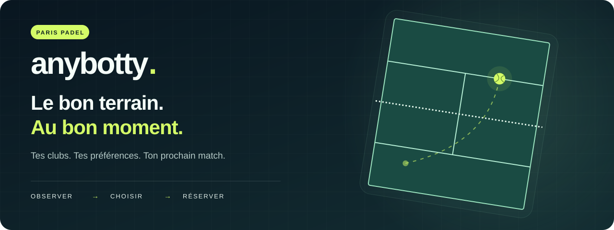
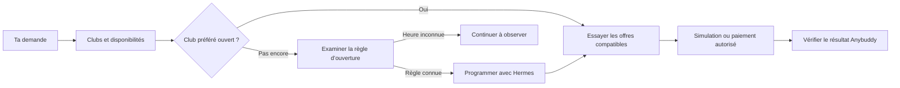

<div align="center">



# Paris Padel · Anybotty

**Le prochain match commence par un message.**

Trouve ton terrain sur Anybuddy ou 4PADEL. Réserve, retrouve ta partie et annule si ton programme change.
Choisis tes clubs, tes durées et ton budget. Anybotty suit tes préférences jusqu’à la réservation.

**9 clubs Anybuddy · 36 centres 4PADEL · 6 skills Hermes · Open source**

[Démarrer](#demarrer) · [Voir les exemples Telegram](#telegram) · [Guide complet](docs/guide.md) · [Signaler un problème](https://github.com/RolandVrignon/paris-padel-anybotty/issues)

</div>

---

## Le match de 20 h se prépare avant 20 h

Tu connais la scène : quatre joueurs motivés, une heure parfaite, et plus aucun terrain.

Anybotty s’attaque à ce qui se passe **avant** le match : vérifier les clubs, observer quand les nouveaux jours deviennent réservables, choisir quand tenter sa chance et exécuter la réservation selon tes critères.

> « Lundi prochain à 20 h. Paris Padel en priorité, puis UCPA. Une heure, sinon une heure et demie. Intérieur préféré, 80 €/h maximum. Si Paris Padel n’a pas encore ouvert, je préfère attendre. »

Avec Hermes, cette demande devient une stratégie, puis une tentative immédiate ou programmée lorsque l’heure d’ouverture est connue. Tu gardes la main sur les préférences et les dépenses.

**Trois parcours de réservation et d’annulation intégrés.** Anybuddy utilise la carte, UCPA la carte déjà enregistrée, et 4PADEL le portefeuille de crédits pour les quatre joueurs. Le degré d’autonomie dépend du parcours : [voir le comparatif](#autonomie).

<a id="sommaire"></a>
## Le tour du terrain

- [Ce qu’Anybotty fait pour toi](#fonctionnalites)
- [Trois sites, trois parcours](#autonomie)
- [Parle padel, pas JSON](#telegram)
- [La stratégie avant le clic](#strategie)
- [Tes préférences, dans le bon ordre](#preferences)
- [Les clubs et le catalogue 4PADEL](#clubs)
- [Démarrer](#demarrer)
- [Réserver directement chez UCPA](#ucpa)
- [Réserver sur 4PADEL avec les crédits](#fourpadel)
- [Crédits et alertes avant le cron](#credits-programmes)
- [Brancher Hermes et Telegram](#hermes)
- [Choisir le bon mode](#modes)
- [Ce qui est validé, ce qui reste à prévoir](#fiabilite)
- [Sous le capot et documentation](#documentation)
- [Contribuer et origine](#contribuer)

<a id="fonctionnalites"></a>
## Ton assistant de bord de terrain

| Tu veux… | Anybotty s’en charge |
| --- | --- |
| **Jouer dans tes clubs favoris** | Résout les noms du catalogue et cherche dans ton ordre de priorité. |
| **Viser les horaires demandés** | Observe les nouvelles disponibilités pour documenter les ouvertures. |
| **Tenter à l’ouverture** | Hermes programme une tentative sur le VPS à partir d’une règle vérifiée ou d’un horaire que tu donnes. |
| **Garder de la souplesse** | Accepte 60, 90 ou 120 minutes, intérieur ou extérieur, dans l’ordre que tu choisis. |
| **Respecter ton budget** | Compare le prix du terrain à un plafond **par heure**, quelle que soit la durée. |
| **Aller jusqu’au bout** | Gère le choix du terrain, les conditions connues et la confirmation autorisée, par carte ou crédits selon le site. |
| **Préparer ton portefeuille 4PADEL** | Contrôle les crédits à la programmation, puis 24 h avant la tentative ; signale le montant manquant dans Telegram. |
| **Changer de programme** | Liste les réservations, affiche leurs conditions et annule sur demande. |
| **Savoir ce qui s’est passé** | Conserve les observations et les résultats ; distingue une offre trouvée d’une réservation confirmée. |

<a id="autonomie"></a>
## Trois sites, trois parcours

**Réserver pendant que tu dors : c’est le but.** Les trois intégrations savent réserver, lister et annuler ; leurs conditions de paiement diffèrent.

| Site | Réservation réelle | Autonomie et prérequis | Depuis Hermes |
| --- | --- | --- | --- |
| **Anybuddy** | Paiement par carte, puis vérification dans le compte. | Peut aboutir sans intervention ; un 3-D Secure demandé interrompt le parcours autonome. | Skills de réservation et de gestion intégrés. |
| **UCPA Paris 19 officiel** | Réservation avec la carte déjà enregistrée ; prélèvement annoncé au début de la partie. | Parcours réel testé sans intervention bancaire, avec une session et une carte valides. | Commandes locales disponibles ; raccordement aux skills à faire. |
| **4PADEL officiel** | Les **quatre parts** payées avec le portefeuille LA FID’. | Parcours réel testé sans carte ni 3-D Secure. Solde suffisant et club éligible nécessaires ; recharge manuelle. | Réservation et programmation avec contrôles de crédits dans les skills du dépôt ; mise à jour VPS nécessaire. |

Les commandes officielles UCPA et 4PADEL ciblent chacune un club. Leur intégration au moteur commun de priorités entre clubs et sites reste à faire. Les tests réussis valident les parcours observés ; ils ne garantissent ni la disponibilité future d’un terrain ni l’absence de changement côté site.

<a id="telegram"></a>
## Parle padel, pas JSON

Une fois [Hermes connecté](#hermes) et les skills à jour, tu pilotes les réservations **via Anybuddy ou 4PADEL officiel** depuis ton bot Telegram. Précise le site souhaité : les mêmes clubs peuvent avoir des disponibilités différentes selon la plateforme. Les exemples suivants sont des **demandes à envoyer au bot**. UCPA officiel conserve ses commandes séparées.

### 🔎 Trouver

> Quels clubs connais-tu à Bercy ? Vérifie le nom exact de Sportfield.

> Quels créneaux sont disponibles dimanche à 4PADEL Paris 20 à 12 h 30, pour 60 ou 90 minutes ?

### 🎯 Choisir le bon moment

> Je veux jouer lundi prochain à 20 h. Paris Padel d’abord, UCPA ensuite. Si Paris Padel doit encore ouvrir, attends son ouverture avant de te rabattre sur UCPA. Propose-moi la stratégie.

> À quelle heure les nouveaux créneaux apparaissent-ils ? Est-ce répété sur plusieurs jours ou publié par semaine ?

### 🗓️ Programmer

> Programme une réservation réelle à l’ouverture vérifiée du club prioritaire, avec mes préférences et mon plafond de 80 €/h. Si l’heure n’est pas connue, dis-le-moi.

> Quelles tentatives sont programmées ? Annule celle de lundi à 20 h.

### 🎾 Réserver et gérer

> Réserve et paie lundi prochain à 20 h chez Sportfield Bercy : 60 minutes, sinon 90, intérieur uniquement, maximum 80 €/h pour le terrain entier.

> Liste mes réservations à venir et les conditions d’annulation de celle de jeudi.

> Annule ma réservation de jeudi à 20 h chez Sportfield Bercy.

### 💳 4PADEL officiel : clubs et crédits

> Liste les centres 4PADEL autour de Paris et vérifie l’identifiant de Créteil.

> Quel est mon solde de crédits 4PADEL ?

> Sur le site officiel 4PADEL, programme une réservation à Boulogne pour dans 17 jours à 20 h : 90 minutes, sinon 120, maximum 60 €/h. Utilise l’heure d’ouverture vérifiée et préviens-moi si je dois recharger mon portefeuille.

Le bot contrôle la provision avant programmation et prépare un second contrôle 24 heures avant le cron. Si l’heure d’ouverture est inconnue, il le signale avant de programmer.

**Tu veux d’abord voir ?** Ajoute « simule, sans payer ». Une simulation atteint le récapitulatif ; elle ne confirme pas la réservation.

[Tous les exemples et les commandes Hermes →](docs/guide.md#parler-au-bot-en-langage-naturel)

<a id="strategie"></a>
## La stratégie avant le clic

Ton deuxième club a une place aujourd’hui. Ton premier choix ouvre demain. **Le premier disponible n’est pas toujours ton premier choix.**

Avec `padel-strategy`, Hermes compare les offres disponibles, tes priorités et les ouvertures observées. Il peut recommander d’attendre le club préféré, puis programmer une tentative si la règle d’ouverture est suffisamment documentée. Le plan B est réévalué après le résultat.



Le collecteur réalise **12 suivis toutes les cinq minutes** : huit clubs sur Anybuddy, UCPA Paris 19 sur son site officiel, puis 4PADEL Boulogne-Billancourt, Saint-Ouen et Paris 20 en direct. Le timer systemd fonctionne sans modèle IA ; seul 4PADEL nécessite un compte. Il observe plusieurs dates pour repérer les ouvertures quotidiennes, les publications groupées et les ajouts d’horaires.

Une date absente à 07 h 55 et présente à 08 h donne une ouverture **entre 07 h 55 et 08 h**. Cinq contrôles supplémentaires vérifient la présence de disponibilités pendant environ 25 minutes. Le bot conserve les observations ; il ne transforme pas un seul relevé en règle certaine.

Les observations restent séparées par club et par site. La réservation fonctionne sur Anybuddy et, avec des commandes dédiées, sur les sites officiels UCPA Paris 19 et 4PADEL. Le collecteur reste en lecture seule : il ne crée aucune réservation et ne soumet aucun paiement. [Configurer le suivi officiel](docs/direct-monitoring.md).

**Sur le site officiel 4PADEL :** Boulogne sert de référence horaire pour Paris 20 et Saint-Ouen, dont le calendrier affiche J+30 malgré une restriction de réservation. La règle commune **J+14 (« moins de 15 jours »)** est une hypothèse de travail pour ces deux centres. Le rapport expose les ouvertures de Boulogne et leurs confirmations, sans tentative de réservation périodique ni autorisation supposée acquise. [Détails du suivi](docs/direct-monitoring.md).

**Deux rôles distincts :** systemd observe ; le cron Hermes déclenche la tentative. La commande directe `booking:search` cherche immédiatement, sans attendre une ouverture future.

[Comprendre les observations](docs/opening-observation.md) · [Programmer selon une politique d’ouverture](docs/guide.md#programmer-selon-la-politique-douverture)

<a id="preferences"></a>
## Tes préférences, dans le bon ordre

Deux fichiers, deux usages :

| Fichier local | Ce que tu y mets |
| --- | --- |
| `config.fixed.json` | Ton compte Anybuddy, les comptes des sites officiels sous `providers`, le navigateur et les données de paiement Anybuddy si tu actives la réservation réelle. |
| `config.request.json` | Le match que tu veux : date, heure, clubs, durées, type de terrain et plafond horaire. |

Exemple de demande — **remplace la date avant de lancer** :

```json
{
  "date": "21/09/2026",
  "startTime": "20:00",
  "clubs": ["paris-padel", "ucpa-paris", "sportfield-bercy"],
  "durationsMinutes": [60, 90],
  "courtEnvironment": ["indoor", "outdoor"],
  "maxPricePerHourEUR": 80
}
```

| Préférence | Traduction |
| --- | --- |
| `[60, 90]` | Une heure de préférence, 90 minutes en second choix. **120 minutes exclues.** |
| `[90, 60, 120]` | 90 minutes d’abord, puis 60, puis 120. |
| `["indoor", "outdoor"]` | Intérieur préféré, extérieur accepté. |
| `["indoor"]` | Intérieur uniquement. |
| `["any"]` | Peu importe le type de terrain. |

L’ordre complet est **club → durée → intérieur/extérieur → terrain**. Avec `[60, 90]` et `["indoor", "outdoor"]`, une heure dehors passe avant 90 minutes dedans, dans le même club.

### Le budget qui suit la durée

Un plafond de **80 €/h** autorise jusqu’à **80 € pour 60 min**, **120 € pour 90 min** ou **160 € pour 120 min**. Un terrain à 120 € pour deux heures revient à 60 €/h : il respecte donc le plafond.

Le prix concerne **le terrain entier**, pas chaque joueur. Le montant du checkout fait foi et est revérifié avant le paiement. Les demandes utilisent `DD/MM/YYYY` et `HH:mm`. Pour Anybuddy et UCPA Paris 19, les heures sont en Europe/Paris. Pour 4PADEL officiel, elles suivent le fuseau du centre : Europe/Paris en métropole, Indian/Reunion à La Réunion.

[Configuration complète, carte et compatibilité →](docs/guide.md#configurer-le-compte)

<a id="clubs"></a>
## Tes clubs, à Paris et au-delà

### Anybuddy : neuf clubs parisiens

Neuf centres sont intégrés au catalogue **Anybuddy**. Les horizons ci-dessous sont des **observations du 11 septembre 2026**, pas des règles contractuelles ni des disponibilités en direct.

| Club | Identifiant | Horizon observé |
| --- | --- | --- |
| Paris Padel | `paris-padel` | J+8 |
| UCPA Sport Station Hostel Paris | `ucpa-paris` | J+8 |
| Sportfield Paris 12 - Bercy | `sportfield-bercy` | J+14 |
| 4PADEL Paris 20 | `4padel-paris-20` | J+3 |
| Forest Hill Aquaboulevard De Paris | `aquaboulevard` | J+6 |
| 4Padel Saint-Ouen | `4padel-saint-ouen` | J+1 |
| Padelistes Bercy - Paris 12 | `padelistes-bercy` | J+8 |
| Padel 15 | `padel-15` | J+5 |
| Trinquet Village | `trinquet-village` | Au moins J+61 ; limite inconnue |

Trinquet Village reste au catalogue mais est exclu de la surveillance des ouvertures. Les heures d’ouverture ne sont pas garanties par ces horizons : elles doivent être documentées séparément.

[Catalogue source](data/clubs.json) · [Audit des horizons](data/horizon-audit-2026-09-11.json) · [Parcours de checkout par club](docs/checkout.md)

### 4PADEL officiel : les 36 centres du réseau

Le catalogue reprend **tous les centres 4PADEL proposés par le sélecteur officiel au 13 septembre 2026**, de Paris à Bordeaux, Lyon ou La Réunion. Chaque entrée conserve le nom exact du site, son identifiant natif, sa région et son fuseau horaire.

```sh
# Consulter les centres et leurs identifiants, sans connexion
npm run 4padel -- clubs

# Actualiser la liste depuis le site officiel, sans modifier le code
npm run 4padel -- clubs --refresh
```

Quelques identifiants pour préparer ta demande :

| Centre | Identifiant du bot |
| --- | --- |
| Paris 20 | `4padel-paris-20` |
| Saint-Ouen | `4padel-saint-ouen` |
| Boulogne-Billancourt | `4padel-boulogne` |
| Créteil | `4padel-creteil` |
| Lyon Saint-Priest | `4padel-lyon-saint-priest` |
| Saint-Louis – Bâle | `4padel-saint-louis-bale` |
| Saint-Louis – La Réunion | `4padel-saint-louis-la-reunion` |

Les identifiants existants restent valides lors d’une actualisation. Le parcours de réservation est partagé par la plateforme ; les créneaux, les conditions d’annulation et l’éligibilité aux crédits dépendent du centre.

[Les 36 centres et leurs données](data/fourpadel-clubs.json) · [Réserver en crédits](#fourpadel)


<a id="demarrer"></a>
## Ton premier essai

**Prérequis : Node.js 22.22.2 ou 24 et npm.** Un compte Anybuddy est nécessaire pour le checkout ; le catalogue et les observations publiques fonctionnent sans compte.

```sh
git clone https://github.com/RolandVrignon/paris-padel-anybotty.git
cd paris-padel-anybotty
npm ci
npm run config:init
```

Chromium est téléchargé à l’installation. Complète `config.fixed.json` avec ton compte et `config.request.json` avec une date future et tes préférences, puis :

```sh
# Connexion visible et vérification de la session
npm run auth:login-headed
npm run auth:check -- --headless

# Premier essai : atteindre le récapitulatif, sans paiement
npm run booking:search
```

**Sites officiels :** les connexions 4PADEL et UCPA ont leurs propres sessions vérifiées côté serveur. Renseigne `providers.4padel.account` et `providers.ucpa.account` dans la configuration fixe, puis utilise `npm run auth:4padel` ou `npm run auth:ucpa`. Les commandes `auth:4padel:check` et `auth:ucpa:check` contrôlent les sessions enregistrées. [Guide d’authentification](docs/authentication.md).

Pour explorer sans connexion :

```sh
npm run clubs:list
npm run 4padel -- clubs
npm run booking:plan -- --config config.request.json.sample
```

Le planning est théorique ; adapte la date de l’exemple. **`npm start` affiche l’état du projet** : il ne réserve rien et ne démarre pas le collecteur.

Les deux configurations, `.auth/` et les observations restent locales et sont ignorées par Git. Les fichiers privés créés par `config:init` ont les permissions `0600`. Renseigne les secrets sur la machine qui exécute le bot, jamais dans Telegram.

<a id="ucpa"></a>
## UCPA Paris 19 : du créneau à l’annulation

**Réserve directement sur le site officiel, puis retrouve et gère ta partie depuis le terminal.** Le bot prend le premier terrain intérieur disponible à l’heure demandée, respecte l’ordre des durées et vérifie le prix du terrain entier par heure.

Après `npm run auth:ucpa`, utilise ta demande dans `config.request.json` avec le club `ucpa-paris` :

```sh
# Aller au récapitulatif sans réserver
npm run ucpa -- book --headed

# Créer une réservation réelle avec la carte déjà enregistrée chez UCPA
npm run ucpa -- book --confirm

# Retrouver la partie et consulter son détail
npm run ucpa -- list
npm run ucpa -- show --id IDENTIFIANT

# Lire les conditions, puis reprendre la version renvoyée pour annuler
npm run ucpa -- cancel --id IDENTIFIANT
npm run ucpa -- cancel --id IDENTIFIANT --confirm --expected-version VERSION
```

UCPA annonce un **prélèvement au début de la partie** : le clic « Réserver » engage réellement le capitaine, même sans débit immédiat. Le parcours intégré utilise une carte déjà enregistrée, sans abonnement ni réduction. L’annulation porte sur **la partie entière**, à plus de 48 heures du début, après vérification qu’elle est gratuite pour tous les joueurs.

Une tentative incertaine se vérifie avec `npm run ucpa -- reconcile`, en conservant sa date et son heure. Le journal empêche une nouvelle soumission automatique du même créneau, y compris après annulation ; une nouvelle intention après annulation reste à intégrer.

**Validé en réel :** réservation, apparition dans le compte et annulation sans frais. Les commandes UCPA sont disponibles localement ; leur branchement aux skills Hermes et au moteur de priorités entre clubs reste à faire.

[Options, résultats et détails du parcours UCPA →](docs/ucpa-booking.md)

<a id="fourpadel"></a>
## 4PADEL : les quatre parts, directement en crédits

**Un portefeuille approvisionné, un créneau compatible, les quatre joueurs couverts.** Le bot règle le terrain entier avec les crédits LA FID’. Une seule part en crédits peut encore demander une carte en garantie et un 3-D Secure : le parcours autonome sélectionne donc systématiquement **quatre parts**.

Renseigne `providers.4padel.account` dans `config.fixed.json`, recharge ton portefeuille sur le site officiel, puis :

```sh
npm run auth:4padel
npm run 4padel -- wallet

# Aperçu sans réservation : adapter la date et l’heure
npm run 4padel -- book --club 4padel-paris-20 --date YYYY-MM-DD --time HH:mm

# Même demande, réservation réelle : paiement intégral en crédits
npm run 4padel -- book --club 4padel-paris-20 --date YYYY-MM-DD --time HH:mm --confirm

# Retrouver la réservation et consulter son détail
npm run 4padel -- list
npm run 4padel -- show --id IDENTIFIANT

# Lire les conditions, puis annuler avec la version renvoyée
npm run 4padel -- cancel --id IDENTIFIANT
npm run 4padel -- cancel --id IDENTIFIANT --confirm --expected-version VERSION
```

**Un parcours commun pour les [36 centres du catalogue](#clubs).** Le club doit être explicite ; sans date ou heure en argument, le script utilise `config.request.json`. Les durées, les préférences intérieur/extérieur et le plafond horaire s’appliquent au terrain entier.

Ton club favori peut rester Saint-Ouen même si tu joues à Boulogne : Playwright sélectionne le centre demandé sur l’accueil, puis ouvre **« Que souhaites-tu faire » → « Réserver une piste »**. Il vérifie le club affiché et les identifiants renvoyés par le calendrier avant de choisir un terrain. Le navigateur utilise le fuseau du centre pour afficher les bons horaires, y compris à La Réunion.

**Solde insuffisant : arrêt avant création de la demande.** Le bot actualise le portefeuille et ne bascule pas sur un paiement bancaire. Une tentative incertaine se relit avec `npm run 4padel -- reconcile --club CLUB --date YYYY-MM-DD --time HH:mm`, sans répéter le paiement.

L’annulation respecte le délai du club et restitue un **avoir**, pas un remboursement bancaire. Vérifie le retour des crédits avec `npm run 4padel -- wallet` : l’annulation et la restitution sont deux résultats distincts.

**Validé en réel à Saint-Louis – Bâle :** terrain à 36 €, quatre parts payées en crédits, réservation confirmée sans carte ni 3-D Secure, puis annulation et retour du solde de 83 € à 119 €. Ce test sert de référence au parcours partagé par les clubs 4PADEL. Le catalogue peut être actualisé pour intégrer les nouveaux centres sans modifier le code.

<a id="credits-programmes"></a>
### Le bon solde avant le bon créneau

Uniquement pour une réservation réelle sur **4PADEL officiel**, Hermes prévoit trois contrôles :

1. **À la préparation du cron :** actualiser le solde. Si la provision est insuffisante, indiquer le manque et attendre la recharge avant de programmer.
2. **24 heures avant l’exécution du cron :** actualiser à nouveau le solde et transmettre le résultat dans Telegram. En cas de manque, demander une recharge ; la tentative reste programmée.
3. **À la réservation :** vérifier le solde disponible face au prix réel des quatre parts, avant de créer la demande.

La provision est calculée avec **le plafond horaire × la plus longue durée acceptée** : 80 €/h et [60, 90] → 120 €. Elle couvre toutes les options autorisées sans prétendre connaître le tarif futur. Aucun crédit n’est réservé par ces contrôles. Si le cron part dans moins de 24 heures, le premier contrôle couvre l’étape anticipée ; aucun rappel dans le passé n’est créé.

Exemple : un match dans 17 jours, avec une ouverture prévue dans 3 jours, entraîne un contrôle maintenant, un second dans 2 jours et le contrôle final dans 3 jours. L’heure d’ouverture doit toujours être documentée ou explicitement donnée.

**Exemple d’alerte Telegram à J−1 du cron :**

> Crédits 4PADEL — Solde : 90 €. Provision cible : 120 €. Il manque 30 € : recharge le portefeuille avant la tentative.

Une erreur de lecture produit une alerte « solde impossible à vérifier ». Les messages reviennent dans le chat qui a créé la tâche, une fois le code déployé et les deux crons natifs Hermes enregistrés. Une annulation de la tentative désactive aussi son contrôle de crédits. Les réservations Anybuddy et UCPA utilisent leur parcours carte.

[Commandes, clubs, délais et fonctionnement du portefeuille →](docs/fourpadel-booking.md)

<a id="hermes"></a>
## Un message le soir. Une tentative à l’ouverture.

Le VPS exécute le navigateur et les tâches programmées. Hermes transforme tes demandes Telegram en appels aux scripts du dépôt. **Les skills couvrent Anybuddy et les tentatives sur 4PADEL officiel**, avec contrôle du portefeuille avant programmation. La gestion des réservations officielles reste accessible par les commandes dédiées [UCPA](#ucpa) et [4PADEL](#fourpadel).

Les changements du dépôt doivent être déployés sur le VPS, les skills réinstallés et la session 4PADEL préparée avant d’utiliser cette programmation depuis Telegram. Le raccordement d’UCPA officiel au scheduler reste à faire. Aucun déploiement ni cron n’est créé par une modification du code local.

**Hermes et son intégration Telegram doivent déjà être installés.** Depuis la copie du dépôt sur le VPS :

```sh
npm run hermes:install

# Anybuddy : après avoir renseigné le fichier fixe privé sur ce VPS
npm run auth:login -- --headless
npm run auth:check -- --headless

# 4PADEL officiel : compte sous providers.4padel.account
npm run auth:4padel -- --headless
npm run auth:4padel:check
npm run 4padel -- wallet
```

L’installateur ajoute les six skills dans `~/.hermes/skills/` et adapte les chemins au dépôt. Recharge-les dans Telegram avec `/reload-skills`.

| Skill | Sa spécialité |
| --- | --- |
| [padel-clubs](skills/padel-clubs/SKILL.md) | Le catalogue et les disponibilités Anybuddy. |
| [padel-booking](skills/padel-booking/SKILL.md) | Tes préférences, la simulation et le paiement autorisé sur Anybuddy ou 4PADEL officiel. |
| [padel-strategy](skills/padel-strategy/SKILL.md) | Attendre ton favori ou choisir un repli. |
| [padel-scheduling](skills/padel-scheduling/SKILL.md) | Programmer une tentative ; prévoir le contrôle de crédits à J−1 pour 4PADEL officiel. |
| [padel-monitoring](skills/padel-monitoring/SKILL.md) | Observer quand les nouvelles dates apparaissent. |
| [padel-reservations](skills/padel-reservations/SKILL.md) | Lister, consulter et annuler tes réservations Anybuddy. |

Installer les skills ne crée aucun cron. Hermes doit enregistrer la tâche et vérifier son existence pour pouvoir annoncer qu’elle est programmée. Les résultats des tentatives programmées reviennent dans le chat d’origine.

[Installer le timer sur un VPS](docs/guide.md#installer-la-surveillance-sur-un-vps) · [Installation Hermes détaillée](docs/guide.md#installer-les-skills-sur-le-vps)

<a id="modes"></a>
## Explorer, simuler ou réserver : à toi de choisir

| Action | Commande | Effet |
| --- | --- | --- |
| Voir les clubs | `npm run clubs:list` | Consulte le catalogue. |
| Lire les observations | `npm run observe:report` | Affiche les relevés enregistrés. |
| Collecter une fois | `npm run observe:once` | Relève les trois sites, sans programmer la suite ni réserver. |
| Réserver sur le site officiel 4PADEL | `npm run 4padel -- book --club CLUB --date YYYY-MM-DD --time HH:mm --confirm` | Paie les quatre parts en crédits LA FID’, sans repli sur la carte. Sans `--confirm` : aperçu. [Guide](docs/fourpadel-booking.md). |
| Lister les centres officiels 4PADEL | `npm run 4padel -- clubs` | Liste les identifiants exacts ; `--refresh` actualise le catalogue public. |
| Consulter le portefeuille 4PADEL | `npm run 4padel -- wallet` | Actualise le solde auprès du serveur. |
| Vérifier une tentative 4PADEL | `npm run 4padel -- reconcile --club CLUB --date YYYY-MM-DD --time HH:mm` | Relit le résultat sans répéter le paiement. |
| Annuler sur le site officiel 4PADEL | `npm run 4padel -- cancel --id ID` | Aperçu, puis `--confirm --expected-version HASH` ; délai vérifié et statut relu. [Guide](docs/fourpadel-booking.md). |
| Simuler sur le site officiel 4PADEL | `npm run 4padel -- book --club 4padel-paris-20 --headed` | Vérifie le checkout et les parts, sans réserver. [Guide](docs/fourpadel-booking.md). |
| Lister ses réservations 4PADEL | `npm run 4padel -- list` | Lit les réservations du capitaine, confirmées ou en attente. |
| Simuler sur le site officiel UCPA | `npm run ucpa -- book --headed` | Atteint le récapitulatif ; aucune réservation soumise. |
| **Réserver sur UCPA** | `npm run ucpa -- book --confirm` | **Crée une réservation réelle**, avec prélèvement annoncé le jour du match. |
| Gérer ses parties UCPA | `npm run ucpa -- list` | Les actions `show` et `cancel` permettent le détail et l’annulation gratuite. [Guide](docs/ucpa-booking.md). |
| Simuler tes préférences | `npm run booking:search` | Cherche un récapitulatif conforme, sans paiement. |
| Vérifier la configuration carte | `npm run payment:check` | Contrôle les champs locaux sans les afficher ni contacter la banque. |
| **Réserver et payer sur Anybuddy** | `npm run booking:pay -- --headless` | **Soumet un paiement réel** pour une offre conforme. |
| Vérifier une tentative incertaine | `npm run booking:reconcile -- --headless` | Relit le compte, sans soumettre un nouveau paiement. |
| Lister tes réservations | `node scripts/reservations.js list` | Consulte les réservations à venir et en attente. |

Les commandes de recherche et de réconciliation **Anybuddy** utilisent `config.request.json`, ou un fichier explicite avec `--config PATH`. Pour vérifier une tentative passée, garde **la demande originale**.

Une simulation peut créer un panier impayé côté Anybuddy. Le mode `checkout:preview` permet aussi d’aller jusqu’à Stripe et de remplir la carte sans confirmer le paiement. Les options et le parcours d’annulation sont dans le [guide complet](docs/guide.md).

<a id="fiabilite"></a>
## Des résultats vérifiés, des limites visibles

**Un `booked`, c’est une réservation retrouvée et confirmée dans le compte du site utilisé.** Un récapitulatif atteint ou une réponse de paiement intermédiaire ne suffit pas.

- **Parcours réel validé à UCPA via Anybuddy :** paiement puis annulation de la réservation de test, avec vérification du statut.
- **Parcours officiel UCPA validé :** réservation du 21 septembre à 7 h, apparition dans le compte, puis annulation sans frais confirmée. Le prix est contrôlé pour le terrain entier, et non pour la seule participation du capitaine. [Détails](docs/ucpa-booking.md).
- **Parcours officiel 4PADEL validé :** le 13 septembre 2026, réservation à Saint-Louis – Bâle pour 36 € en crédits, quatre parts confirmées sans 3-D Secure ; annulation avec le script et restitution des 36 € vérifiées. [Détails](docs/fourpadel-booking.md).
- **Neuf checkouts inspectés jusqu’à Stripe le 11 septembre 2026 :** sélection du terrain et différences entre formulaire carte direct et choix du moyen de paiement documentées. Cela ne vaut pas neuf paiements réels validés.
- **Protection contre les doubles tentatives :** verrou local, vérification du compte et journal avant paiement. Un résultat incertain arrête les essais automatiques.
- **Décision manuelle possible sur Anybuddy :** une réinitialisation explicite archive la tentative avant un nouvel essai autorisé. Elle ne prouve pas que l’ancienne transaction est annulée. [Procédure](docs/guide.md#réserver-et-payer).
- **Navigation 4PADEL vérifiée :** changement de club depuis l’accueil, calendriers de Créteil et de La Réunion, et affichage dans le fuseau du centre.
- **Tests locaux :** catalogue complet, identifiants historiques, préférences, prix, modales, paiements simulés, annulation, observation, crons et contrôles de crédits. Au 13 septembre 2026, les 201 tests et ESLint passent.

Sur le parcours carte Anybuddy, le 3-D Secure peut demander une validation humaine ; la reprise interactive après fermeture du navigateur n’est pas encore implémentée. Le parcours 4PADEL intégré utilise uniquement les crédits pour les quatre parts : il ne désactive ni ne contourne une authentification bancaire. Les créneaux peuvent disparaître, les sessions expirer et le site changer : **l’horaire de déclenchement ne garantit pas l’obtention du terrain**.

<a id="documentation"></a>
## Sous le capot

**Node.js · Playwright · Chromium · systemd · Hermes · Telegram**

Les collecteurs observent les disponibilités publiques et le calendrier authentifié 4PADEL. Playwright exécute le parcours du compte et du checkout. Les scripts exposent des résultats JSON ; Hermes s’en sert pour expliquer, décider et programmer. La tentative programmée exécute une demande figée, sans appel à un modèle pour choisir ses paramètres à l’ouverture.

| Pour aller plus loin | Ressource |
| --- | --- |
| Installer, configurer, utiliser et dépanner | [Guide complet](docs/guide.md) |
| Comprendre la mesure des ouvertures | [Protocole d’observation](docs/opening-observation.md) |
| Comprendre les modales, conditions et formulaires | [Checkouts par club](docs/checkout.md) |
| Réserver et annuler sur 4PADEL avec les crédits | [Parcours 4PADEL et avoirs](docs/fourpadel-booking.md) |
| Tester le parcours du site officiel UCPA | [Réservations UCPA](docs/ucpa-booking.md) |
| Adapter les comportements Hermes | [Les six skills](skills/) |
| Consulter les catalogues | [Clubs Anybuddy](data/clubs.json), [centres 4PADEL](data/fourpadel-clubs.json) et [parcours carte](data/payment-routes.json) |

<a id="contribuer"></a>
## Fais entrer ton club dans la partie

Un nouveau club, un parcours qui change, une règle d’ouverture mieux documentée ? Les contributions sont les bienvenues. Pour signaler un problème, joins la commande, le statut obtenu et le comportement attendu, en retirant les informations personnelles et les secrets.

```sh
npm run eslint
npm test
```

Projet indépendant, non affilié à Anybuddy ni aux clubs cités. Issu de [Paris Tennis](https://github.com/RolandVrignon/par-ici-tennis), avec la base conservée dans [reference/paris-tennis/](reference/paris-tennis/) et l’historique documenté dans [ORIGIN.md](ORIGIN.md). Distribué sous [licence MIT](LICENSE).

---

<div align="center">

**Tes quatre joueurs. Ton club préféré. Et une meilleure façon de viser le bon créneau.**

[Commencer](#demarrer) · [Ouvrir le guide](docs/guide.md) · [Voir le code](https://github.com/RolandVrignon/paris-padel-anybotty)

</div>
